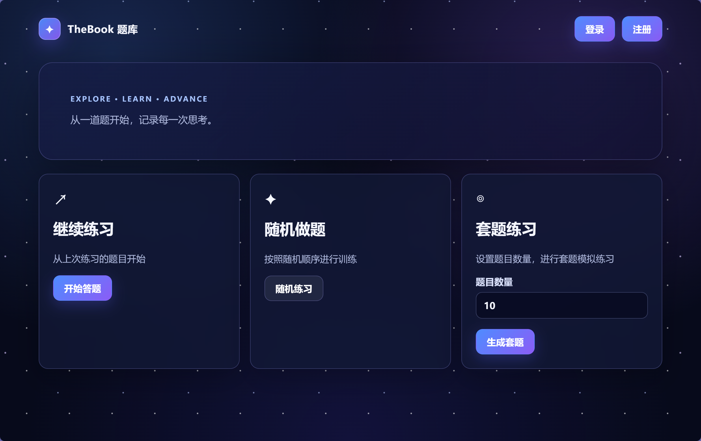
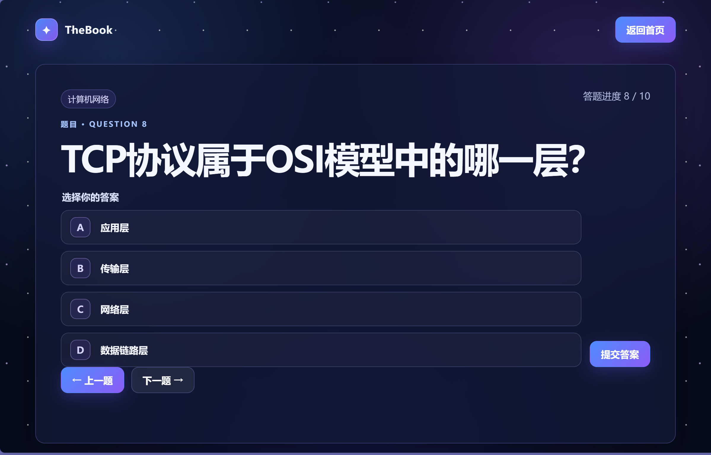

# TheBook

基于 Go、Gin 的在线答题与练习系统。

## 功能特性

- 用户注册、登录与JWT身份验证
- 顺序答题同时支持基于做题进度
- 随机题目练习
- 随机套题生成、练习与测试
- 套题提交、判题、结果与解析查看
- 用户答题记录持久化
- 运行日志记录

## 技术栈

- Go
- Gin
- JWT
- bcrypt
- zap
- SQLite + GORM

## 项目结构

```
TheBook/
├── auth/                 # JWT 认证、密码哈希与认证中间件
├── config/               # 项目配置
├── database/             # 旧 JSON 数据文件与备份数据
├── sqlite/               # SQLite 数据库初始化、迁移与导入工具
├── logger/               # zap 请求、业务与错误日志
├── model/                # 领域模型与核心业务结构
│   ├── bank/             # 数据存储接口及 JSON/SQLite 实现
│   ├── manager/          # 用户、题目、进度、套题等业务管理器
│   └── structs/          # 用户、题目、套题、请求响应等实体结构
├── service/              # Gin 路由、Handler 与系统初始化
├── front_end/            # HTML 页面与前端静态资源
│   └── static/           # CSS、图标等静态文件
│       └── favicon/      # 网站图标
├── test/                 # 自动化测试
│   ├── config_test/      # 配置测试
│   ├── gin_handler_test/ # Handler 与路由测试
│   ├── load_file_test/   # JSON 或数据加载测试
│   ├── middleware_test/  # 中间件测试
│   └── utils_test/       # 工具函数测试
└── utils/                # 通用工具函数
```

## 环境要求

Go 1.16 或更高版本
SQLite 3.0 或更高版本

## 快速开始
1. 克隆项目到本地
```bash
git clone https://github.com/wuwuhechen/TheBook
cd TheBook
```

2. 安装依赖
```bash
go mod tidy
```

3. 运行项目
```bash
go run main.go
```

4. 打开浏览器访问 `http://localhost:8080`，即可使用在线答题与练习系统。

## 项目演示

<center>运行后首页</center>


<center>单题练习页面</center>


<center>套题练习页面</center>

## 题库与用户数据自定义

### 自定义题库

可以按照 `database/` 目录下的 JSON 文件格式自定义题库，暂时仅支持单选题。将自定义的 JSON 文件放入 `database/` 目录下，并重命名为 `data.json`。

### 自定义用户

可以按照 `database/` 目录下的 JSON 文件格式自定义用户，将自定义的 JSON 文件放入 `database/` 目录下，并重命名为 `users.json`。

### 数据导入
运行 `go run utils/migrate/migrate.go` 脚本将 JSON 数据导入 SQLite 数据库。

> [!warning]
> 执行 `go run utils/migrate/migrate.go`后，系统会生成 `database/your_database.db` 文件，作为 SQLite 数据库文件。此处的 `your_database.db` 可以根据需要修改为其他名称。完成导入后，需要在 `config/config.json` 中修改 `database_path` 为新生成的数据库文件路径。
> 若设定的数据库文件名称冲突，请先删除旧的数据库文件或修改名称后再执行导入操作。

## 后续计划
- 添加对于多选题、判断题等题型的支持
- 实现历史记录查询
- 实现错题本和套题续做功能
